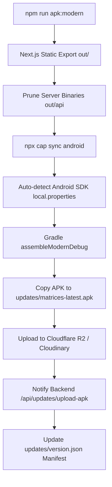

# Matrices Mobile Catalogue & APK / iOS Build Guide

The **Matrices Mobile Catalogue** is a hybrid mobile application and responsive web app built with **Next.js 16**, **React 19**, **Tailwind CSS v4**, and **Capacitor 8**.

It equips field sales representatives with a fast product catalog, interactive cart, offline-first wishlist ordering, device hardware permissions (Camera, GPS Location, Local Storage), and automated Over-The-Air (OTA) application updates.

---

## 📋 System Prerequisites

* **Node.js**: `v18.x`, `v20.x`, or `v22.x` LTS
* **Package Manager**: `npm` (v9+) or `pnpm`
* **Java Development Kit (JDK)**: `JDK 17` or `JDK 21` (Verify with `javac -version`)
* **Android Studio & SDK**:
  * Android SDK Platform (API 34 or API 35)
  * Android SDK Build-Tools (34.0.0+)
  * Android SDK Platform-Tools & Command-line Tools
* **Environment Variables**:
  * `ANDROID_HOME` pointing to `C:\Users\<username>\AppData\Local\Android\Sdk`
  * Add `%ANDROID_HOME%\platform-tools` and `%ANDROID_HOME%\cmdline-tools\latest\bin` to your system `PATH`.
* **EAS CLI** *(For iOS Builds)*: Installed globally or via `npx eas-cli`

---

## ⚙️ Environment Variables Configuration (`.env`)

Create or update the `.env` file in the `matrices/` directory:

```env
# Backend REST API Endpoint (Must not have trailing slash)
NEXT_PUBLIC_API_URL="https://magnum-backend.vercel.app"

# Public Web Production URL
NEXT_PUBLIC_FRONT_END_URL="https://matrices.devcodz.com"

# Optional: Cloudflare R2 Storage (Direct upload credentials during local APK builds)
R2_ACCOUNT_ID="7da914369c5d04406de2def716d9e887"
R2_ACCESS_KEY_ID="3a91ce283fcb9a032c7f765736ab2c72"
R2_SECRET_ACCESS_KEY="97a6bfdd15bb1106ad1b1fb5173099e5e130f91d34debb3c701bdd05a513c53f"
R2_BUCKET_NAME="matrices"
R2_PUBLIC_URL="https://pub-c21ca23422064fc880b5eb6abde8a05e.r2.dev"
R2_FOLDER_NAME="matrices"
```

---

## 🚀 Installation & Web Development

### 1. Install Node Dependencies

```bash
cd matrices
npm install
```

### 2. Run Web Development Server

```bash
npm run dev
```
* Starts the local Next.js development server at `http://localhost:3000`.
* Test responsive mobile views using Chrome / Edge DevTools (Device Emulation mode).

---

## 🤖 Android APK Compilation & Automated Deployment

The project provides automated scripts to compile static web assets, sync native bridges, trigger Gradle builds, package APK binaries, upload to Cloud storage, and update the backend version manifest.

### 1. Build Modern Android APK (Android 7.0+ / API 24+)

```bash
npm run apk:modern
```
* **Target Audience**: Modern smartphones and salesrep tablets (Android 7.0 through Android 15).
* **Generated File**: `android/app/build/outputs/apk/modern/debug/app-modern-debug.apk`
* **Packaged File**: `updates/matrices-latest.apk`

---

### 2. Build Legacy Android APK (Android 4.4+ / API 19+)

```bash
npm run apk:legacy
```
* **Target Audience**: Older rugged handheld terminals or POS devices running Android 4.4 KitKat to Android 6.0 Marshmallow.
* **Generated File**: `android/app/build/outputs/apk/legacy/debug/app-legacy-debug.apk`

---

### 3. Build All APK Flavors Concurrently

```bash
npm run apk:build
```
* Compiles both Modern and Legacy debug APK flavors in a single command.

---

### 4. What Happens During Automated APK Build?



1. **Static Export**: Runs `build-mobile.mjs` to generate the static `out/` HTML/JS export.
2. **Asset Pruning**: Removes server API routes from the client web bundle to keep the APK compact.
3. **Native Synchronization**: Runs `npx cap sync android` to copy assets and register native Capacitor plugins (Camera, Geolocation, Filesystem, Updater).
4. **Gradle Compilation**: Auto-resolves `android/local.properties` and runs `gradlew.bat assembleModernDebug`.
5. **Storage Upload**: Automatically uploads the new APK to Cloudflare R2 bucket under `matrices/apk/app-release/matrices-latest.apk`.
6. **OTA Manifest Generation**: Updates `updates/version.json` with new file size, checksum, and download links.

---

## ⚡ Over-The-Air (OTA) Live Update Packaging

Sales representatives do not need to download a full APK every time you update web UI or business logic. You can ship instant live updates using Capgo:

```bash
npm run package:update
```

### What this does:
1. Compiles the latest static web export.
2. Creates an encrypted/checksummed ZIP archive: `updates/app-v1.2.0.zip`.
3. Updates `updates/version.json` with the new version manifest.
4. When salesreps open their mobile app, the background updater downloads and applies the delta bundle automatically.

---

## 🍏 iOS IPA Build via EAS Cloud

To compile an iOS IPA package for Apple iPhone/iPad:

```bash
npm run ipa:build
```

### Workflow:
1. Builds the static mobile bundle.
2. Runs `npx cap sync ios` to generate the native Xcode project.
3. Runs `scripts/patch-ios-eas.mjs` to inject EAS build configuration and CocoaPods hooks.
4. Submits the build to Expo Application Services (EAS) cloud builders.

---

## 📱 Manual Android Studio Workflow

If you prefer building and debugging directly through Android Studio:

```bash
# 1. Export web bundle and sync native plugins
npm run cap:sync

# 2. Open native Android project in Android Studio
npx cap open android
```
* Click **Run 'app'** (`Shift + F10`) to deploy and live-debug on an attached physical Android device via USB debugging.

---

## 🔍 Troubleshooting & FAQ

| Problem | Cause | Solution |
| :--- | :--- | :--- |
| `Could not read script .../cordova.variables.gradle` | Running `cap copy` instead of `cap sync` | Run `npm run cap:sync` to regenerate the plugin Gradle bridge. |
| `SDK location not found. Define a valid SDK location...` | Missing `android/local.properties` | The build script creates this automatically. Manually add `sdk.dir=C\:\\Users\\<username>\\AppData\\Local\\Android\\Sdk` in `android/local.properties`. |
| `Failed to fetch Geist from Google Fonts` | Network timeout during Next.js build | Ensure active internet connection or configure offline local fonts. |
| Camera / GPS permission not prompting | Missing permission declaration in `AndroidManifest.xml` | Ensure `CAMERA`, `ACCESS_FINE_LOCATION`, and `ACCESS_COARSE_LOCATION` are present in `android/app/src/main/AndroidManifest.xml`. |
| White / blank screen on app launch | Missing base path in static export | Ensure `output: 'export'` is configured in `next.config.mjs`. |
