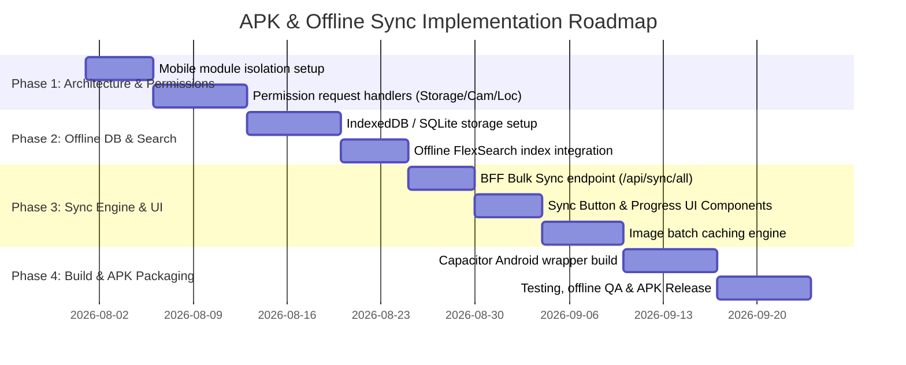

# Product Catalogue - Mobile APK & Offline Sync Project Scope

## Executive Summary
This document defines the technical scope, architectural strategy, and implementation requirements for converting the **Product Catalogue Site** into a native/hybrid **Mobile APK (Android Application)**. The primary goals are to establish a clean separation between web and mobile codebase files, implement native hardware/OS permissions (Camera, Location, Storage), enable robust offline-first functionality (including offline search), and provide a seamless manual **Sync Engine** for pre-loading catalog data onto sales representatives' devices.

---

## 1. Modular Architecture & File Separation

To maintain clean code hygiene and prevent APK-specific dependencies from bloating the standard Next.js web application, APK related assets and bridge native modules will be isolated.

### File & Directory Structure
```
product-catalogue-site/
├── mobile/                           # Isolated Mobile & APK Module
│   ├── android/                      # Native Android Studio project container
│   ├── capacitor.config.json         # Native runtime configuration
│   ├── permissions/                  # Native OS Permission Handlers
│   │   ├── camera.permission.ts
│   │   ├── location.permission.ts
│   │   └── storage.permission.ts
│   ├── storage/                      # Local Offline DB Adapters (IndexedDB / SQLite)
│   │   ├── catalog-db.ts
│   │   ├── image-cache-db.ts
│   │   └── sync-queue-db.ts
│   ├── sync/                         # Offline-First Sync Engine
│   │   ├── sync-engine.ts
│   │   ├── sync-status.listener.ts
│   │   └── delta-fetcher.ts
│   └── bridge/                       # Native Bridge (Web ↔ Native Wrapper)
│       └── native-adapter.ts
├── app/                              # Next.js Web App Core Routes
├── components/                       # Shared UI Components
│   └── mobile/                       # APK-Specific UI (Sync Bar, Network Banner)
│       ├── sync-button.tsx
│       ├── offline-indicator.tsx
│       └── sync-progress-modal.tsx
└── lib/                              # Shared Utilities & Contexts
```

---

## 2. Device Permission Management System

The mobile application will integrate Capacitor / Native Plugins to interact directly with Android OS hardware APIs. Dedicated user dialogs will request permissions with contextual explanations before calling OS level permission popups.

| Permission | Purpose in Catalogue APK | Required Android Manifest Permissions | Fallback / Graceful Behavior |
| :--- | :--- | :--- | :--- |
| **Storage** | Saving downloaded product images, catalog PDFs, offline SQLite/IndexedDB databases, and exported reports locally. | `READ_EXTERNAL_STORAGE`<br>`WRITE_EXTERNAL_STORAGE`<br>`READ_MEDIA_IMAGES` *(Android 13+)* | Fallback to temporary in-memory blob cache (cleared when app closes). |
| **Camera** | Capturing shop check-in photos, barcode scanning of product packages, and shop storefront verification. | `CAMERA` | Disables image capture feature; allows file upload from existing gallery photos only. |
| **Location** | Recording salesrep GPS coordinates during shop check-ins, auto-verifying shop distance, and geo-tagging orders. | `ACCESS_FINE_LOCATION`<br>`ACCESS_COARSE_LOCATION` | Manual location lookup or shop selection with audit flag for missing GPS verification. |

### Permission Request Flow
1. **Contextual Explanation UI**: Show app dialog explaining *why* the permission is needed (e.g., *"Location access is required to verify your shop check-in point"*).
2. **OS Permission Request**: Trigger native OS prompt (`Camera.requestPermissions()`, `Geolocation.requestPermissions()`).
3. **Permission Denial Handling**: If denied, display a user-friendly modal with a quick button linking to system settings (`App.openAppSettings()`).

---

## 3. Offline-First & Network Resiliency Architecture

Sales representatives frequently operate in low-connectivity or offline environments (e.g., basements, rural shops, warehouses). The app must remain 100% functional without an active network connection.

```
                  +-----------------------------------+
                  |        Sales Representative       |
                  +-----------------------------------+
                                    |
                    +---------------+---------------+
                    |                               |
              [ Online ]                       [ Offline ]
                    |                               |
       Fetch from BFF Server            Query Local IndexedDB / SQLite
       (app/api/products)               (FlexSearch & Local Caches)
                    |                               |
                    +---------------+---------------+
                                    |
                       Render Catalogue Smoothly (60fps)
```

### Core Offline Requirements
- **Local Storage Engine**: IndexedDB (via `Dexie.js`) or Capacitor SQLite plugin for high-performance offline indexing.
- **Offline Search Engine**: Client-side full-text search index powered by `FlexSearch` or `Lunr.js` operating directly on locally stored products. Search responses must resolve in under **50ms**.
- **Offline Wishlist & Prioritization**: Wishlist reordering and sorting priority rules stored locally and synced when online.
- **Image Offline Cache**: Product thumbnail images and assets stored in CacheStorage or native filesystem (`Capacitor.Filesystem`), served via local Blob URLs when offline.
- **Network Detection**: Centralized `useNetworkStatus` hook observing `navigator.onLine` and native network state.

---

## 4. Bulk Download & Data Sync Engine ("Sync" Button)

A key requirement is the manual **Sync** button that allows sales reps to download all necessary product catalog data, categories, subcategories, shop lists, and images to their device before heading into the field.

### Sync Button UI & Components
- **Placement**: Header navigation bar (desktop & mobile top bar) and settings menu.
- **Visual State**:
  - **Idle / Synced**: Green indicator showing last synced timestamp (e.g., *"Synced 2 hrs ago"*).
  - **Syncing**: Animated spinning sync icon with live percentage completion pill (e.g., *"Syncing 45%"*).
  - **Offline / Stale**: Yellow warning badge prompting user to sync when connected to Wi-Fi.

### Data Sync Workflow
1. **Sync Initiated**: User clicks **"Sync Data"** button.
2. **Connectivity & Storage Check**: Verify network status and ensure at least 250MB free storage space on device.
3. **Bulk API Fetch**:
   - Call `/api/catelogue/sync/all` to fetch JSON payloads of all active categories, subcategories, products, and shop data.
4. **Local Database Populate**: Atomic write transaction inserting records into local IndexedDB / SQLite store.
5. **Asset & Image Download Engine**:
   - Concurrently batch-download product thumbnail images in groups of 10.
   - Save binary image blobs locally and register path mappings in `image-cache-db`.
6. **Search Index Rebuild**: Build/update client-side `FlexSearch` index.
7. **Sync Completion Notification**: Display clear toast/modal: *"Catalog successfully synced! 1,250 products & 180 images downloaded."*

### Incremental / Delta Syncing
To save bandwidth and time, future syncs after the initial bulk download will use **Delta Syncing**:
- Request only items modified after `lastSyncTimestamp`.
- Remove deleted products locally and update modified prices/stock levels.

---

## 5. Performance & User Experience Goals

- **60 FPS Smooth Scrolling**: Virtualized lists (`@tanstack/react-virtual` or `react-window`) for browsing 5,000+ catalog items offline.
- **Instant Filtering**: Category and wishlist filters update instantly (< 20ms) from local memory state.
- **Zero Blank States**: If network drops mid-session, UI gracefully shifts to offline cache without error screens or broken image icons.

---

## 6. Implementation Roadmap



---

## 7. Next Steps & Action Items
1. Review and approve `PROJECT_SCOPE.md`.
2. Create isolated `/mobile` workspace directory inside `product-catalogue-site`.
3. Set up Capacitor Android environment and permission wrapper classes.
4. Implement `/api/catelogue/sync/all` endpoint on BFF server for bulk data downloads.
